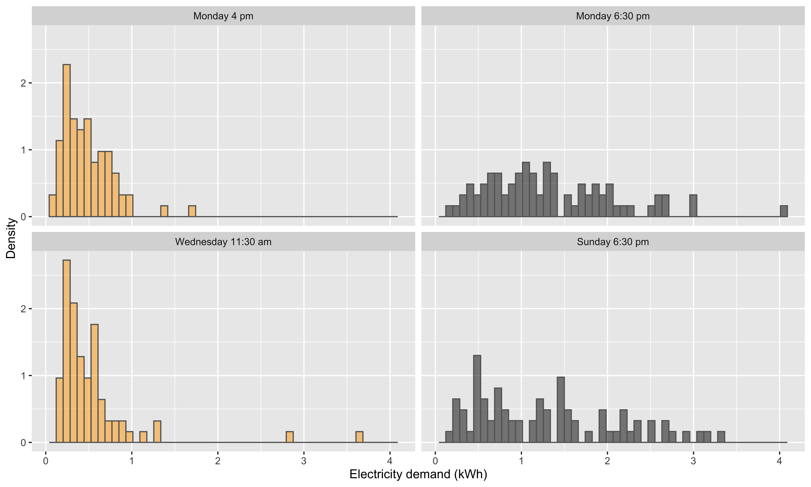
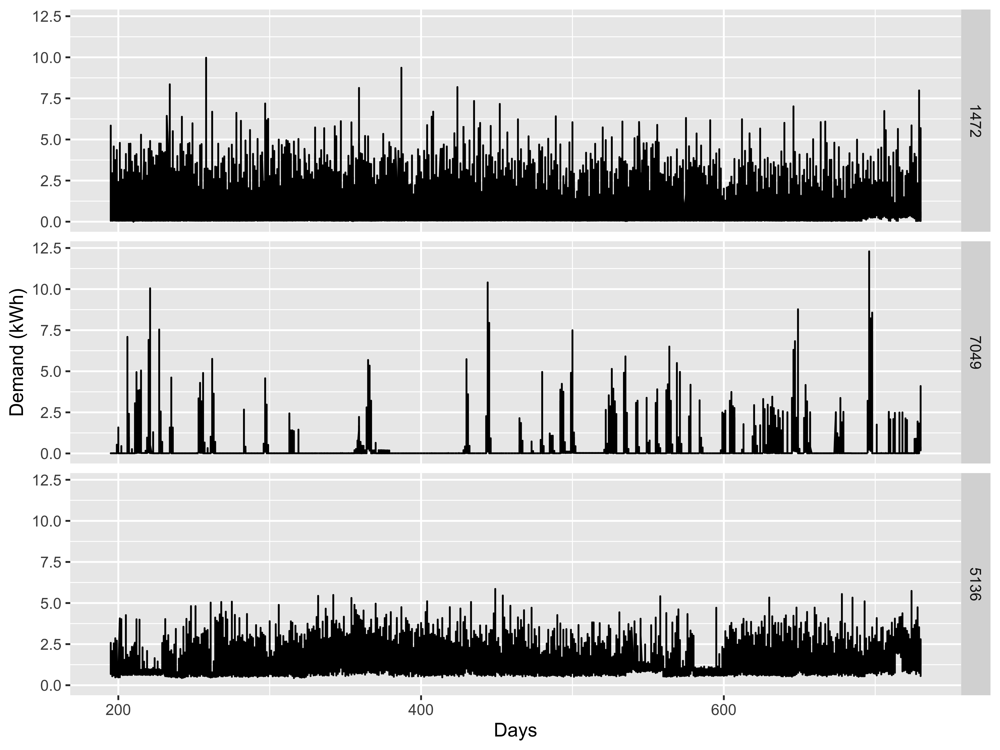
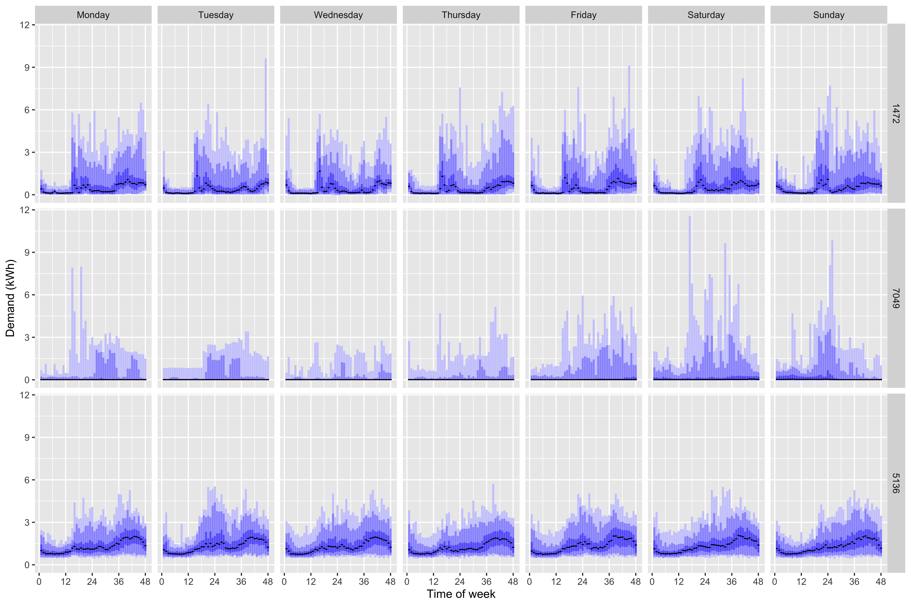

```{r setup, include=FALSE}
knitr::opts_chunk$set(
  echo = TRUE,
  cache = TRUE,
  messages = FALSE,
  warning = FALSE,
  eval = TRUE
  # include = FALSE
)
options(tinytex.verbose = TRUE)
```

```{r packages, include=FALSE}
library(dimRed)
library(tidyverse)
library(ggplot2)
library(reshape2)
library(knitr)
library(kableExtra)
library(tibble)
library(patchwork)
library(data.table)
library(dtplyr)
library(igraph)
library(ggraph)
set.seed(1)
Jmisc::sourceAll(here::here("R/sources")) # if running within mlann.Rproj
```

\newpage

# Introduction

Dimension reduction is an important tool for exploring and analyzing data for tasks such as clustering, classification, visualization, and anomaly detection. If high-dimensional data lie on a lower-dimensional manifold, then manifold learning algorithms (see @Cayton2005-dp, @Lee2007-wq, and @Izenman2012-mx for reviews) can be used to extract a low dimensional representation of the data. Applications of manifold learning algorithms include classification and visualization in prostate cancer gene expression analysis [@Witten2011-vq] and hyperspectral image analysis [@Lunga2014-kc], image reconstruction during an MRI acquisition [@Zhu2018-jw], and proteomic signaling network analysis in cancer [@Banerjee2019-at]. Of particular concern in this paper is the case where the manifold of interest is a *statistical manifold*, by which we mean a manifold whose elements are probability distributions rather than vector-valued variables (for a general overview of statistical manifolds, see @Amari2016-hk). Examples of statistical manifolds arise in analyzing cell characteristics in clinical cell cytometry [@Carter2009-ti] and detecting anomalous probability distributions of household electricity usage [@Hyndman2018-ia]. Many popular manifold learning algorithms require finding nearest neighbors of each observation. When observations are vector-valued, the Euclidean or Manhattan distance can be used, and efficient algorithms exist that circumvent the need to compute all pairwise distances via brute force. However, in the case of statistical manifolds, such algorithms cannot be exploited, meaning that finding nearest neighbors poses a computational bottleneck, particularly when the number of observations is large. To address this problem, we propose (and prove the consistency of) an estimator for Hellinger (or total variation) distance that can also be expressed in terms of the Euclidean (or Manhattan) distance between two vectors. This can be combined with nearest neighbor algorithms enabling more computationally efficient learning of statistical manifolds.

Linear methods for dimension reduction date at least as far back as the development of Principal Components Analysis (see @Johnstone2009-gf, @Li2017-ot, @Fan2019-qv, and @Tang2021-qq for generalization of PCA), while a number of non-linear methods were developed in the 1960s [@Shepard1962-ac; @Shepard1962-ft; @Kruskal1964-iv; @Kruskal1964-md]. A further flourishing in the development of non-linear dimension reduction techniques gained traction after ISOMAP [@Tenenbaum2000-fr] and Local Linear Embedding (LLE) [@Roweis2000-ni] were introduced in the same issue of *Science*. These methods assume data lie on a manifold and are hence known as manifold learning techniques. Some algorithms developed in the early 2000s include, but are not limited to, Laplacian eigenmaps [@Belkin2003-kz], Hessian LLE [@Donoho2003-am], local tangent space alignment [@Zhang2003-yi], diffusion maps [@Nadler2006-cm; @Coifman2006-no], and semi-definite embedding [@Weinberger2006-dc]. When it comes to large-scale data, Nystr{\"o}m approach and Locally Linear Landmarks are explored but only in spectral problems [@Drineas2005-zr; @Talwalkar2008-fl; @Vladymyrov2013-tr]. More contemporary algorithms including t-SNE [@Van_der_Maaten2008-dv] and UMAP[@McInnes2018-xo], have been shown to be well-suited to the visualization of many real-world datasets. While these algorithms all differ, most contain a common step which is to compute a graph of $K$-nearest neighbors. These include ISOMAP, LLE, Laplacian Eigenmaps, Hessian LLE, t-SNE, and UMAP, which are the six manifold learning algorithms we consider in this paper.

Computing $K$ nearest neighbors can be a significant computational bottleneck especially when the number of observations is large. A naive way to find the nearest neighbors is to compute pairwise distances between all observations - an $O(N^2)$ operation. For some metrics including Euclidean and Manhattan distance, more efficient solutions that find the $K$ nearest neighbors in $O(Nlog(N))$ time are available, such as k-d trees [@Bentley1975-zo] and Annoy [@Bernhardsson2016-tf]. Popular software implementations of manifold learning techniques, including the R package *dimRed* [@Kraemer2018-zf] exploit k-d trees algorithms. For applications with an extremely large number of observations, faster approximate versions of k-d trees can be used for nearest neighbor search [@Van_Der_Maaten2014-in]. @McQueen2016-xz provides one such implementation through the Python package, *megaman*, which exploits the *FLANN* [@Muja2009-de] package for fast neighbor searching[^1].
However, for statistical manifolds, the distance between observations is no longer Euclidean, and these approximate nearest neighbor methods are not applicable.

[^1]:approximate nearest neighbors using k-d trees can be implemented in R using the C++ ANN library [@mount2010-ann] which is wrapped in the R package *RANN* [@jefferislab2019-l2]

The main contribution of this paper is to find a way to combine efficient exact and approximate nearest neighbor algorithms with learning of statistical manifolds. Previously, @Lee2007-qa parameterize discrete probability mass functions as points on a hypersphere but do not carry out nonlinear dimension reduction, concluding that *"it is unrealistic in terms of speed to use algorithms with a complexity of $O(N^2)$ when $N$ is large"*.  Recognizing that the approach of @Lee2007-qa may fail when the statistical manifold in question lies on a submanifold of the hypersphere, @Carter2009-ti propose manifold learning using the Fisher information metric. However, their method for computing this metric can be computationally expensive. @Tong2021-ps develop a new measuring distance called Diffusion Earth Mover's Distance for large size of high-dimensional data, but it requires vector-based data and pre-computed nearest neighbors. Finally, @Hyndman2018-ia compute the Jensen Shannon distance between two density estimates and then apply Laplacian Eigenmaps using the very same dataset we consider in \autoref{smartmeter}. In all four of these papers, all $N^2$ pairwise distances are computed, making them infeasible for applications with over a few thousand observations.

Estimating the distance (or more generally divergence) between two probability distributions using samples taken from each distribution is a well-studied problem in machine learning and statistics. Our focus will be on non-parametric estimators which make minimal assumptions about the density functions and can be categorized into plug-in estimators and direct estimators. In plug-in methods, the estimate of a distribution function is found using methods such as $K$-nearest neighbors and kernel density estimation. For example, @Kandasamy2015-iw consider $L_2$, Rényi, and Tsallis-$\alpha$ divergences via von Mises
expansion with plug-in kernel density estimates. @Poczos2011-wa focus on the Rényi and Tsallis divergence estimation. @Poczos2011-wa and @Poczos2012-ng provide Rényi, $L_2$ divergence, and $\alpha$-divergence estimators using certain $K$-nearest neighbors based statistics. Although the estimator is easy to calculate, the $K$-nearest neighbors in the samples of distributions are pre-required. None of these papers consider learning of statistical manifolds, and indeed these methods are impractical for our objective which is to avoid a computationally expensive $K$-nearest neighbor search. For direct methods, a relationship between the measure function and a functional in the Euclidean space is found. @Hero2001-pc and @Hero2002-ik investigate the estimation of Rényi divergence but assume that one of the two density functions is known. @Nguyen2009-fi and @Nguyen2010-gc provide a plug-in estimator for the f-divergence by estimating the likelihood ratio of two density functions. However, this involves solving a convex minimization problem, which is very demanding for large $N$.

To overcome these issues, we propose an approach similar to that proposed by @Wang2005-zs. 
@Wang2005-zs estimate KL divergence by approximating the Radon-Nikodym derivative via a data-dependent partition of a reference sample space. Since we are concerned with manifold learning, we require a symmetric distance measure, and therefore propose an estimate of Hellinger distance or total variation distance. The reference measure used to partition the data is the marginal distribution over all $N$ observational units. By exploiting a connection between the Hellinger and total variation distance and the $L_2$ and $L_1$ norm respectively, we are able to find nearest neighbors using k-d trees which has a computational complexity of $O(Nlog(N))$ rather than $O(N^2)$.  In principle, even further speed up may be achieved with approximate nearest neighbor algorithms.  To the best of our knowledge, this approach has not been previously proposed in the literature and represents the main novel contribution of our paper. While we acknowledge the shortcomings of Hellinger and total variation metrics compared to the Fisher information metric as used by @Carter2009-ti, we note that Hellinger and total variation metrics approximate Fisher information metric well locally; i.e. when the distance between two probability distributions is small. This is precisely the situation likely to be encountered when $N$ is large and the statistical manifold is more densely sampled.

We demonstrate the potential of our method with an application to smart meter data where the main objective of the analysis is visualization and anomaly detection. We show that manifold learning algorithms can be implemented quickly using k-d trees. The exact version of k-d trees can even be faster than ANN when the number of grid points used in the discrete approximation is high.  For a fixed manifold learning algorithm, the effect of using ANN on the accuracy of the embedding and the identified anomalies is minor. Low dimensional visualizations identify structure in the data, whether that be in the time of week during which electricity is used, or in the way that anomalous households from far away regions of the embedding are very different from one another.

<!-- Computing $K$ nearest neighbors can be a significant computational bottleneck especially when the number of observations is large. A naive way to find the nearest neighbors is to compute pairwise distances between all observations - an $O(N^2)$ operation. For some metrics including Euclidean and Manhattan distance, more efficient solutions that find the $K$ nearest neighbors in $O(Nlog(N))$ time are available, for example, k-d trees [@Bentley1975-zo]. Some software implementations of manifold learning techniques, including the R package *dimRed* [@Kraemer2018-zf] exploit such algorithms. For applications with an extremely large number of observations, faster approximate versions of k-d trees can be used for nearest neighbor search [@Van_Der_Maaten2014-in]. @McQueen2016-xz provides one such implementation through the Python package, *megaman*, which exploits the *FLANN* [@Muja2009-de] package for fast neighbor searching[^1]. However, to the best of our knowledge, no work has been done on evaluating the effect of using approximate nearest neighbors on the accuracy of embeddings produces by manifold learning algorithms.  Furthermore, more recent research on approximate nearest neighbor search has seen alternative and arguably more efficient alternatives to k-d trees emerge, including Annoy [@Bernhardsson2016-tf] and Hierarchical Navigable Small Worlds (HNSW) [@Malkov2020-jp].  Consequently, the first main novel contribution in this paper is to thoroughly evaluate the impact of using approximate nearest neighbor search within manifold learning and to compare a broad range of approximate nearest neighbors in doing so. -->

<!-- We evaluate the impact of using approximate nearest neighbor search in manifold learning in two main ways. First, it is important to establish that using ANN algorithms improves, in a substantive manner, the speed of manifold learning algorithms. Via a thorough empirical study using the benchmark MNIST dataset, we establish that in practice, up to a four-fold improvement in computational time can be achieved when using ANN, relative to exact nearest neighbors even if k-d trees are used for the exact solution. The improvements in computational speed are greatest for the Annoy algorithm and for Laplacian Eigenmaps or UMAP. Second, it is important to establish that using ANN algorithms does not lead to a substantial deterioration in the accuracy of embeddings produced by manifold learning algorithms. UMAP [@McInnes2018-xo] and variations of t-SNE [@Van_Der_Maaten2014-in; @Tang2016-ho] try to accelerate the nearest neighbor searching process using a tree-based method or NN-Descent algorithm [@Dong2011-ee], but the evaluations are limited to the accuracy of the neighborhood graph. Instead, the low-dimensional embeddings, which is the final output of manifold learning, tend to be tricky to explain and the topological information can be inaccurate. Therefore, we use multiple embedding quality measures in \autoref{qualitymeasure} for the evaluation of manifold learning accuracy. Again using the benchmark MNIST data, we find that using ANN instead of exact nearest neighbors leads to an almost negligible reduction in embedding accuracy exceeding 5% in only a small number of cases. The impact of using ANN on embedding accuracy is much smaller than the impact of choosing a different manifold learning algorithm. These results are robust to different choices of ANN algorithm and to a range of measures of embedding accuracy. -->

The rest of the paper is organized as follows.
In \autoref{distestimate}, we present our proposed distance estimator and prove the strong consistency.
\autoref{mlann} serves as a primer defining the algorithms used throughout the paper in detail and with consistent notation. It is composed of three subsections; the first deals with different manifold learning algorithms, the second with approximate nearest neighbor methods, and the last with the quality measure of embedding used in this paper. Readers familiar with one or more of these topics may comfortably skip the corresponding subsections.
\autoref{smartmeter} contains the application to visualize and identify anomalies in household electricity usage using Irish smart meter data. In this section, we provide further justification for the use of our distance estimator in statistical manifold learning, including in the case where the distance between observations is either the Hellinger of total variation metric between two distributions of electricity usage. We provide some discussion and conclusions in \autoref{conclusion}.

# Distance estimation for statistical manifold learning {#distestimate}

## Estimator of Hellinger and Total Variation distance {#estimator}

We now introduce our estimator for the distance between two probability distributions that can be used when a sample drawn from each distribution is available. Our emphasis will be on Hellinger distance which is related to the L2 norm, however, our results extend to the Total Variation distance which is related to the L1 norm. The Hellinger distance between two probability measures $P$ and $Q$ with sample space $\Omega$ is defined as
\begin{equation}\label{eq:hellingerdef1}
H(P , Q) = \sqrt{ \frac{1}{2} \int_\Omega \bigg( \sqrt{\frac{dP}{dR}} - \sqrt{\frac{dQ}{dR}} \bigg)^2 dR} ,
\end{equation}
where $P$ and $Q$ are absolutely continuous with respect to another measure $R$, and $\frac{dP}{dR}$ and $\frac{dQ}{dR}$ are the Radon–Nikodym derivatives of $P$ and $Q$ respectively. In the context of manifold learning, $P$ and $Q$ will be the measures associated with a pair of observational units. The integral above can be approximated by a discrete sum as follows:
\begin{align}
H(P,Q) &\approx \sqrt{\frac{1}{2} \sum_{i=1}^{T} \bigg( \sqrt{\frac{P(I_i)}{R_r(I_i)}} - \sqrt{\frac{Q(I_i)}{R_r(I_i)}} \bigg)^2 R_r(I_i)} \\
&= \sqrt{\frac{1}{2} \sum_{i=1}^{T} \bigg( \sqrt{P(I_i)} - \sqrt{Q(I_i)} \bigg)^2, (\#eq:hellingerest2)}
\end{align}
where $I_1, I_2,\dots, I_T$ are non-overlapping partitions of the domain of the data (typically $\mathbb{R}$). Our estimator replaces $\sqrt{P(I_i)}$ and $\sqrt{Q(I_i)}$ with their empirical counterparts in a manner that we now describe in detail.

Let $a_1,\dots,a_m\sim P$ be data corresponding to the first observational unit and $b_1,\dots,b_n\sim Q$ be data corresponding to the second observational unit. For the reference measure $R$, we will consider the distribution of the data over all observational units, $c_1,\dots,c_r\sim R$. We first find partitions of (empirically) equal probability using all of the data (i.e. with respect to R):
\begin{equation}\label{eq:segments}
\{I_i^r \}_{i=1,2,\dots,T_r} = \{ (-\infty, c_{(l_r)}], \ (c_{(l_r)}, c_{(2l_r)} ], \dots, \ (c_{(l_r(T_r-1)}, + \infty ) \},
\end{equation}
where $\{c_{(1)}, c_{(2)}, \dots, c_{(r)}\}$ denote the order statistics of $R$, (i.e. $c_{(1)} < c_{(2)} < \dots < c_{(r)}$), $l_r \in \mathbb{N} \leq r$ is the number of sample points from $R$ in each segment, and $T_r$ is the number of segments. Since $l_r \in \mathbb{N}$, the last interval contains $r-l_r(T_r-1) \leq l_r$ points from $R$. The quantities $\sqrt{P(I_i)}$ and $\sqrt{Q(I_i)}$ in Equation \@ref(eq:hellingerest2) can be replaced with their empirical counterparts $\sqrt{P_m(I^r_i)}:=s_i/m$ and $\sqrt{Q_n(I^r_i)}:=t_i/n$. Here $s_i:=\#\{a:a\in I^r_i\}$ and $t_i:=\#\{b:b\in I^r_i\}$ are the number of observations falling into partition $I_i^r$ from $P$ and $Q$ respectively. The Hellinger distance between $P$ and $Q$ can thus be estimated as
\begin{equation}\label{eq:hellingerest1}
\hat{H}(P,Q) =  \sqrt{\frac{1}{2}\sum_{i=1}^{T^r} \left(\sqrt{\frac{s_i}{m}} - \sqrt{\frac{t_i}{n}}\right)^2} \ .
\end{equation}

The right hand side of Equation \@ref(eq:hellingerest1) is equivalent to the Euclidean distance between two vectors $\bm{p}:=(s_1/2m,\dots,s_{T^r}/2m)'$ and $\bm{q}:=(t_1/2n,\dots,t_{T^r}/2n)'$. 
<!-- This is our motivation for using the discrete Hellinger distance estimator. Based on two empirical probabilities and a reference probability, we could estimate the true Hellinger distance as $1/\sqrt{2}$ times the $L_2$ norm of vector representatives of the probabilities constructed from data partition \@ref(eq:segments).  -->
In this way, the estimator in Equation \@ref(eq:hellingerest1) allows efficient nearest neighbor algorithms to be exploited for
learning statistical manifolds where only a sample of data from each distribution on the manifold is available.

The total variation distance between $P$ and $Q$ is defined as
\begin{align}\label{eq:tvddef}
TV(P , Q) &= \sup_{E \in \mathcal{F}} |P(E) - Q(E)|
= \frac{1}{2} \int_{\Omega} \left|\frac{dP}{dR} - \frac{dQ}{dR}\right|dR \ ,
\end{align}
where $\Omega$ and $\mathcal{F}$ are the sample space and $\sigma$-algebra respectively.
The estimate for the total variation distance is derived by similar reasoning as
\begin{equation}\label{eq:tvdest1}
\hat{TV}(P , Q) = \frac{1}{2} \sum_{i=1}^{T_r} \bigg| \frac{s_i}{m} - \frac{t_i}{n} \bigg| ,
\end{equation}
which is equal (up to proportionality) to the Manhattan distance between $\bm{p}$ and $\bm{q}$.

## Proof of convergence

We now prove the consistency as $n,m,r\rightarrow\infty$ of the estimator of squared Hellinger distance in Equation \@ref(eq:hellingerest2) and the total variation distance in Equation \@ref(eq:tvddef). The proofs for both estimators are similar, so we will focus on the proof for the Hellinger distance below, pointing out how certain steps generalize to the Total Variation where necessary. Our proof relies on two Lemmas from @Wang2005-zs which we restate here in our own notation.

(ref:lemma1caption) Lemma 1 of [@Wang2005-zs]

::: {.lemma #lemma1 name="(ref:lemma1caption)"}
Let $R$ be an absolutely continuous probability measure and $\{I_i\}_{i=1,\dots,T}$ be a fixed finite partition with $I_i = (\gamma_{i-1}, \gamma_i]$ for $i=1,2,\dots,T$, where $-\infty=\gamma_0 < \gamma_1 < \cdots < \gamma_{T-1} < \gamma_T=+\infty$, such that $R(I_i)=1/T \text{ for } i=1,2,\dots,T$. Let $R_r$ be the empirical probability measure based on i.i.d. samples $\{c_1, c_2,\dots, c_r\}$ generated from $R$ with $r=l_rT$, $l_r\in\mathcal{N}$. Define $\{I_i^r\}_{i=1,\dots,T}$ as a data partition where
\begin{equation}\label{eq:empsegments}
\{I_i^r \}_{i=1,2,\dots,T} = \{ (-\infty, c_{(1)}^r], \ (c_{(1)}^r, c_{(2)}^r], \dots, \ (c_{(T-2)}^r,c_{(T-1)}^r], (c_{(T-1)}^r, +\infty ) \},
\end{equation}
such that $R_r(I_i^r)=\frac{1}{T}$, for $i=1,2,\dots,T$, and where parentheses in subscripts denote order statistics. Then the sequence of partitions $\{\{I_i^r \}_{i=1,2,\dots,T}\}_{r=1,2,\dots}$ converges to the partition $\{I_i \}_{i=1,2,\dots,T}$ with respect to $R$ as $r\rightarrow \infty$.
:::

(ref:lemma2caption) Lemma 2 of [@Wang2005-zs]

::: {.lemma #lemma2 name="(ref:lemma2caption)"}
Let $R$ be a probability measure with sample space $\Omega$ and let $\{I_1, I_2, \dots, I_T\}$ and $\{I_1^r, I_2^r, \dots, I_T^r\}_{r=1,2,\dots}$ be finite measurable partitions of $\Omega$. Let $A$ be an arbitrary probability measure on $\Omega$ which is continuous with respect to $R$. Suppose $A_m$ is the empirical probability measure based on i.i.d. samples $\{a_1, a_2, \dots, a_m\}$ generated from $A$. If $\{I_1^r, I_2^r, \dots, I_T^r\}_{r}$ converges to $\{I_1, I_2, \dots, I_T\}$ with respect to $R$ as $r \rightarrow \infty$, then
\begin{equation}
  \lim_{r \rightarrow \infty}\lim_{m \rightarrow \infty} A_m(I_i^r) = A(I_i) \text{ a.s. for } i=1,2,\dots,T.
\end{equation}
:::

We now state our main theorem as follows.

::: {.theorem #helestimator name="Hellinger and Total Variation Distance Estimators"}
Let $P$, $Q$ be two probability measures each absolutely continuous with respect to a probability measure $R$ and let $H(P,Q)$ and $TV(P,Q)$ respectively both be finite, with estimators given by \@ref(eq:hellingerest1) and \@ref(eq:tvdest1) respectively. Suppose  $T_r$ segments with equivalent $l_r$-spacing are obtained as in \@ref(eq:segments). If $T_r, l_r \rightarrow \infty$, then
\begin{equation}
 \hat{H}(P , Q) \rightarrow H(P, Q)
 \qquad \text{and} \qquad
 \hat{TV}(P , Q) \rightarrow TV(P , Q)
\end{equation}
as $m, n,r,T_r \rightarrow \infty$.
:::

::: {.proof}
The estimation error for the squared Hellinger distance is bounded by the sum of two terms.
\begin{equation}\label{eq:errors}
\begin{aligned}
|\hat{H}^2(P \| Q) - H^2(P \| Q)| &= \frac{1}{2} \bigg| \sum_{i=1}^{T_r} \bigg( \sqrt{\frac{P_m(I_i^r)}{R_r(I_i^r)}} - \sqrt{\frac{Q_n(I_i^r)}{R_r(I_i^r)}} \bigg)^2 R_r(I_i^r) - \int_\Omega \bigg(\sqrt{\frac{dP}{dR}} - \sqrt{\frac{dQ}{dR}} \bigg)^2 dR \bigg| \\
&\leq  \underbrace{\frac{1}{2} \bigg| \sum_{i=1}^{T_r} \bigg( \sqrt{P_m(I_i^r)} - \sqrt{Q_n(I_i^r)} \bigg)^2 -
\sum_{i=1}^{T_r} \bigg( \sqrt{P(I_i)} - \sqrt{Q(I_i)} \bigg)^2 \bigg|}_{e_1} + \\
& \underbrace{\frac{1}{2} \bigg| \sum_{i=1}^{T_r} \bigg(\sqrt{\frac{P(I_i)}{R(I_i)}} - \sqrt{\frac{Q(I_i)}{R(I_i)}} \bigg)^2 R(I_i) - \int_\Omega \bigg(\sqrt{\frac{dP}{dR}} - \sqrt{\frac{dQ}{dR}} \bigg)^2 dR \bigg|}_{e_2}, \\
\end{aligned}
\end{equation}
where $e_1$ is the estimation error induced by the empirical probability measures on the intervals $\{I_i\}$, and $e_2$ is the approximation error induced by the numerical integration of true squared Hellinger distance. Both $e_1$ and $e_2$ could be proved below to be arbitrarily small when the sample sizes $m, n, \text{and } r$ and the number of points within each interval $l_r$ are sufficiently large.

In the case of total variation distance, the estimation error is decomposed as
\begin{equation}\label{eq:tvderrors}
\begin{aligned}
\bigg|\hat{TV}(P , Q) - TV(P , Q) \bigg| &= \frac{1}{2} \bigg| \sum_{i=1}^{T_r} \left| \frac{P_m(I_i^r)}{R_r(I_i^r)} - \frac{Q_n(I_i^r)}{R_r(I_i^r)} \right| R_r(I_i^r) - \int_{\Omega} \left|\frac{dP}{dR} - \frac{dP}{dR}\right|dR \bigg| \\
&\leq \underbrace{\frac{1}{2} \bigg|\sum_{i=1}^{T_r} | P_m(I_i^r) - Q_n(I_i^r) | -
 \sum_{i=1}^{T_r} |P_m(I_i) - Q_n(I_i)| \bigg|}_{e_1} + \\
& \underbrace{\frac{1}{2} \bigg|  \sum_{i=1}^{T_r} \left|\frac{P_m(I_i)}{R_r(I_i)} - \frac{Q_n(I_i)}{R_r(I_i)}\right|R_r(I_i) - \int_{\Omega} \left|\frac{dP}{dR} - \frac{dQ}{dR}\right|dR \bigg|}_{e_2}.
\end{aligned}
\end{equation}

For the approximation error $e_2$, since the distance between $P$ and $Q$ is finite, we have 
\begin{equation}
  \frac{1}{2} \int_\Omega \bigg(\sqrt{\frac{dP}{dR}} - \sqrt{\frac{dQ}{dR}} \bigg)^2 dR < \infty,
  \qquad\text{and} \qquad
  \frac{1}{2} \sum_{\omega \in \Omega} \bigg|P(\omega) - Q(\omega)\bigg| < \infty.
\end{equation}
Then for any $\epsilon > 0$, there exists $\delta = \delta(\epsilon) > 0$ such that if $\max_i{R(I_i)} < \delta$, we have $e_2 < \frac{\epsilon}{2}$. Intuitively, this arises since the integral can be approximated numerically up to an arbitrarily close level of accuracy by the sum. Recall that the data partition $\{I_i\}$ is defined in \@ref(eq:segments) and the number of equidistant intervals is $T_r$, then the probability on interval $\{I_i\}$ is $R(I_i) = 1/T_r$. Therefore, for any $T_r \geq 1 / \delta$, we have 
\begin{equation}\label{eq:e2}
e_2 < \frac{\epsilon}{2}.
\end{equation}

For the remainder of the proof, assume a fixed $T \geq T_r(\epsilon)$, $T \geq  1 / \delta$ for which \@ref(eq:e2) still holds.

For the error $e_1$, we need to show the convergence of the empirical probability measure $R_r$ to the true measure $R$ on the data partition $\{I_i^r\}$ in $e_1$. By Lemma \@ref(lem:lemma1), as $r \rightarrow \infty$, the data partition $\{\{I_i^r\}_{i = 1,2, \dots, T} \}_r$ converges to the partition $\{I_i\}_{i = 1,2, \dots, T}$ with respect to probability measure $R$. 
By Lemma \@ref(lem:lemma2), since $P \ll R$ and $Q \ll R$, for any $i \in \{1,2,\dots,T\}$, we also have
\begin{equation}
  \lim_{m \rightarrow \infty}\lim_{r \rightarrow \infty} P_m(I_i^r) = P(I_i)\, a.s. ,
  \qquad \text{and} \qquad
  \lim_{n \rightarrow \infty}\lim_{r \rightarrow \infty} Q_n(I_i^r) = Q(I_i)\, a.s.\label{eq:asconv}
\end{equation}

By the continuous mapping theorem, this implies $\sqrt{P_m(I_i^r)}\overset{a.s.}{\rightarrow}\sqrt{P(I_i)}$ and $\sqrt{Q_n(I_i^r)}\overset{a.s.}{\rightarrow}\sqrt{Q(I_i)}$. Using standard results about linear combinations of almost sure convergent series and the continuous mapping once again implies that 
\begin{equation}
\lim_{m \rightarrow \infty}\lim_{n \rightarrow \infty}\lim_{r \rightarrow \infty}\left(\sqrt{P_m(I_i^r)} - \sqrt{Q_n(I_i^r)} \right)^2\rightarrow\bigg( \sqrt{P(I_i)} - \sqrt{Q(I_i)} \bigg)^2\, a.s.
\end{equation}
This ensures that for any $\epsilon > 0$, there exists $M_i = m_i(\epsilon, T)$ and $N_i = n_i(\epsilon, T)$, such that for any $m \geq M_i$, $n \geq N_i$, and for any $i \in \{1,2,\dots,T\}$,
\begin{equation}
\label{eq:e1function}
\bigg| f(P_m(I_i^r), Q_n(I_i^r)) - f(P(I_i), Q(I_i)) \bigg| 
= \frac{1}{2} \bigg| \bigg( \sqrt{P_m(I_i^r)} - \sqrt{Q_n(I_i^r)} \bigg)^2 - \bigg( \sqrt{P(I_i)} - \sqrt{Q(I_i)} \bigg)^2 \bigg| 
< \frac{\epsilon}{2T} .
\end{equation}

A similar argument can be used in the case of total variation distance, where the continuous mapping theorem need only be applied once.

Summing over $i=1,2,\dots, T$ yields
\begin{equation}
\frac{1}{2} \bigg| \sum_{i=1}^{T} \bigg( \sqrt{P_m(I_i^r)} - \sqrt{Q_n(I_i^r)} \bigg)^2 -
\sum_{i=1}^{T} \bigg( \sqrt{P(I_i)} - \sqrt{Q(I_i)} \bigg)^2 \bigg| < \frac{\epsilon}{2} \ ,
\end{equation}
for $m \geq \max_i{M_i}$ and $n \geq \max_i{N_i}$. Further, since $T > T_r$ and $f(x,y) \geq 0$, we have 
\begin{equation}\label{eq:e1}
e_1 \leq \frac{1}{2} \bigg| \sum_{i=1}^{T} \bigg( \sqrt{P_m(I_i^r)} - \sqrt{Q_n(I_i^r)} \bigg)^2 -
\sum_{i=1}^{T} \bigg( \sqrt{P(I_i)} - \sqrt{Q(I_i)} \bigg)^2 \bigg| < \frac{\epsilon}{2} \ .
\end{equation}

Combining \@ref(eq:e2) and \@ref(eq:e1), we have $e_1 + e_2 < \epsilon$, hence completing the proof.
:::

# Algorithms for manifold learning and nearest neighbor searching {#mlann}

## Notation

Manifold learning finds a $d$-dimensional representation of data that lie on a manifold $\mathcal{M}$ embedded in a $p$-dimensional ambient space with $d \ll p$. We will denote the original data (or 'input' points) as $x_i$, $i=1,\dots,N$, where $x_i\in\mathbb{R}^p$, while the low-dimensional representation (or 'output' points) will be denoted as $y_i$, $i=1,\dots,N$, where $y_i\in\mathbb{R}^d$. Where two subscripts are used (e.g. $x_{ih}$ or $y_{ih}$), the second subscript refers to the $h^{th}$ coordinate or dimension of the data. Pairwise distances between input points $x_i$ and $x_j$ are denoted $\delta_{ij}$ while pairwise distances between output points $y_i$ and $y_j$ are denoted $d_{ij}$, where $i,j=1,\dots,N$. Unless otherwise stated, these distances are assumed to be Euclidean. Also important is the $K$-ary neighborhoods (or $K$ nearest neighbors) of $x_i$ denoted $U_K(i)$ and defined as a set of points $j$ such that $x_j$ is one of the $K$ or less closest points to $x_i$.

For the manifold learning algorithms discussed in \autoref{ml}, it is often assumed that the manifold lies in a $p$-dimensional ambient space. Although the approximate nearest neighbor algorithms we consider can be applied to metric spaces that are not necessarily Euclidean, they generally require that observations can be characterized as vectors in $\mathbb{R}^p$. Therefore, it may not immediately be clear how these algorithms can be applied to a statistical manifold, which brings the main contribution of the paper. The key advantage of estimating the empirical distributions as discrete over reference bins is that it allows each distribution to be characterized as a vector. In this way, the Hellinger distance estimator between the empirical distributions in \autoref{estimator} would be expressed in $L_2$ norm of squared root vectors, making it possible to conduct computationally efficient manifold learning when the observations are probability distributions.

## Manifold learning algorithms {#ml}

We now briefly describe the manifold learning algorithms used in the remainder of the paper. One feature shared by all algorithms discussed below is that they require $K$ nearest neighbors to be found for all input points. In all implementations of manifold learning algorithms in \autoref{smartmeter}, $K$ is set to 20 for comparison across different methods. Other parameters of the manifold learning algorithms, such as the intrinsic dimension of the manifold [@Denti2021-jl], are also essential to the complexity of the data and the embeddings. For visualization purposes, the dimension $d$ is set to 2 in this paper.

### ISOMAP {-}

ISOMAP [@Tenenbaum2000-fr], short for isometric feature mapping, was one of the first algorithms introduced for manifold learning as a non-linear extension to classical Multidimensional Scaling (MDS) and is described in Algorithm&nbsp;\@ref(alg:isomap). Classical MDS uses the spectral decomposition to find an embedding such that the interpoint distances of the input points $\delta_{ij}$ and interpoint distances of the output points $d_{ij}$ are similar. ISOMAP replaces $\delta_{ij}$ with estimates of the geodesic distance between $x_i$ and $x_j$ along the manifold. The geodesic distances are approximated by constructing a nearest neighbor graph and then finding the shortest path between two points along this graph using Dijkstra’s method [@Dijkstra1959-ml] or Floyd’s method [@Floyd1962-hx].

### LLE {-}

Local Linear Embedding [LLE; @Roweis2000-ni] aims to preserve the local properties of the data and is suited to embedding non-convex manifolds. Details of LLE are provided in Algorithm&nbsp;\@ref(alg:lle). First, each input point $x_i$ is approximated as a linear combination of its $K$-nearest neighbors, $x_j:j\in U_K(i)$, with $w_{ij}$ denoting the weight on $x_j$ used to approximate $x_i$. In the next step, output points are found such that each $y_i$ is well approximated by a linear combination of $y_j:j\in U_K(i)$ and with the weights $w_{ij}$ identical to those computed in the previous step.

Analytical solutions exist both for finding the weights and then, given the weights, to find the output points. The latter involves an eigendecomposition of a matrix that is sparse due to the fact that only $K$ nearest neighbors are used to compute the weights.

### Laplacian Eigenmaps {-}

Laplacian Eigenmaps [@Belkin2003-kz] is based on finding a mapping $f$ from the manifold to $\mathbb{R}^d$ such that the average squared gradient $\int_{x\in\mathcal{M}}||\nabla f(x)||^2$ is minimized. The rationale is that input points close to one another on the manifold should be mapped to output points that are close to one another, hence $f$ should be as flat as possible. Minimizing the average squared gradient of $f$ corresponds to finding eigenfunctions of the Laplace-Beltrami operator. In practice, eigenvectors of the graph Laplacian are found where the graph Laplacian serves as a discrete approximation to the Laplace-Beltrami operator. The graph Laplacian is computed from the $K$-nearest neighbors graph in a way that is described in Algorithm&nbsp;\@ref(alg:le).

### Hessian LLE {-}

Hessian LLE (HLLE; @Donoho2003-am) works with the functional $\mathcal{H}(f)=\int_{x\in\mathcal{M}}||H(f(x))||_F$ which is the average Frobenius norm of the Hessian of a function $f$ where $f:\mathcal{M}\rightarrow\mathbb{R}^d$. The Hessian is defined using orthogonal coordinates on the tangent space of $\mathcal{M}$ which are approximated by taking a singular value decomposition of the $K$-nearest neighbors around each point. If there exists a mapping from the manifold $\mathcal{M}$ to $\mathbb{R}^d$ that is locally isometric, then the null space of $\mathcal{H}(f)$ is spanned by the original coordinates. The functional $\mathcal{H}(f)$ can be estimated, and spectral methods are then used to find the null space and hence recover the isometric coordinates. This is outlined in Algorithm&nbsp;\@ref(alg:hlle).

### t-SNE {-}

t-Distributed Stochastic Neighbor Embedding [t-SNE; @Van_der_Maaten2008-dv] is a dimension reduction technique well suited for the visualization of high-dimensional data in scatterplots. It works by minimizing the Kullback-Leibler divergence $K L(P \| Q)=\sum_{i} \sum_{j} p_{ij} \log \frac{p_{ij}}{q_{ij}}$ between two distributions, $p_{ij}$ and $q_{ij}$, respectively giving transition probabilities between points in the input and outpoint space. To ensure transitions to nearby points are more probable, the transition probabilities $p_{ij}$ are proportional to a Gaussian kernel evaluated at the Euclidean distance $\delta_{ij}$. To better capture the local data structure and solve the crowding problem[@Van_der_Maaten2008-dv] for nearby points, $q_{ij}$ are chosen to be proportional to $d_{ij}$ evaluated at a normalized Student-t kernel. The bandwidth of the Gaussian kernel, $\sigma_i$ is determined by the *perplexity* which is set to 30 by default. <!--Considering the asymmetry of the Kullback-Leibler divergence, the object function aims at modeling similar points in the input space by nearby points in the embedding space.--> An analytical form of the gradient is used in the Gradient Descent optimization of Kullback-Leibler divergence with details described in Algorithm&nbsp;\@ref(alg:tsne). Variants of the Barnes-Hut algorithm can also be used to approximate the gradient of the object function [@Van_Der_Maaten2014-in].

### UMAP {-}

UMAP [Uniform Manifold Approximation and Projection; @McInnes2018-xo] preserves global structure is motivated by Riemannian geometry and algebraic topology with a large computational advantage over t-SNE. Rather than minimizing interpoint transition probabilities as in t-SNE, UMAP minimizes the error between two topological representations from the input space and embedding space. The error is measured by the cross entropy $C$ of two local fuzzy simplicial sets built as weighted nearest neighborhood graph, with edge weights representing the likelihood that two points are connected. Geometrically, a simplex is a $K$-dimensional object built from connecting $K+1$ points. UMAP captures topological structure by treating the data as a set of simplices and combining them in a specific way described in Algorithm&nbsp;\@ref(alg:umap).
In order to connect with nearby points, UMAP extends a radius outwards at each point until these overlap. The desired separation between nearby embedded points is controlled by the parameter \textit{min\_dist}. Finally, after initializing the embedding using the weighted graph Laplacian, stochastic gradient descent is used to find the most similar graph in lower dimensions. Further details of the algorithm and hyperparameters can be found in Section 4 of @McInnes2018-xo.

## Approximate nearest neighbor searching {#ann}

As seen in the previous section, many manifold learning algorithms begin by finding the graph of nearest neighbors. A naive way to find this graph is to calculate all pairwise distances between each pair of the input data points. This has a complexity of \(O(N^2)\) for \(N\) observations, which is not efficient when the data set is large. Although faster algorithms exist for exact nearest neighbors, for very large \(N\) we propose the use of approximate nearest neighbor algorithms. Whereas an exact nearest neighbor algorithm will, for a given query point \(x_q\), return the point \(x_{q^*}\) such that \(\delta_{q{q^*}} \leq \delta_{qj}\) for all \(j\neq q^*\), an approximate nearest neighbor algorithm returns a point \(x_{q^\dagger}\) such that \(\delta_{q{q^\dagger}} \leq (1+\varepsilon) \delta_{q{q^*}}\) for some tolerance level \(\varepsilon > 0\) [@Arya1998-bv]. This is illustrated in \autoref{fig:ann}. This definition can be generalized to \(K\)-nearest neighbors. Since our objective is to find the $K$ nearest neighbor graph, our query points are the points in the original sample. So the nearest neighbor of each $x_q$ will be $x_q$ itself. This is disregarded and we search for $K+1$ nearest neighbors.

```{r ann, fig.align = 'center', out.width = "80%", echo = FALSE, fig.cap = "Illustration of approximate nearest neighbors (right) compared to exact nearest neighbors (left). The left subplot shows the distance from the true nearest neighbor point $x_{q^*}$ to the query point $x_q$ is $\\delta_{q{q^*}}$, while the right subplot shows that the $(1+\\varepsilon)$ -approximate nearest neighbors (green points) lie within $(1+\\varepsilon) \\delta_{q{q^*}}$ radius from $x_q$. ", eval=TRUE}

```

@Aumuller2020-nk developed a benchmark tool^[available at http://ann-benchmarks.com/.] and evaluated a number of contemporary approximate nearest neighbor searching methods, among which Annoy is one of the competitive methods. 
<!-- Among these methods, Annoy and HNSW are the most competitive ones, so we consider these algorithms in our study. Furthermore, since Annoy is a tree-based method and HNSW is a graph-based method, there is one algorithm from each large class of ANN algorithms.  -->
We will also use k-d trees since this is one of the most widely used algorithms for (approximate) nearest neighbor search. In addition, k-d trees also allow for the special case of exact nearest neighbor search through appropriate selection of the tuning parameters, thus easily allowing us to isolate the effect of using approximate nearest neighbors in manifold learning algorithms. We now briefly describe the approximate nearest neighbor algorithms used in our evaluation, namely, k-d trees and Annoy.

### k-d trees {-}

The k-d tree [@Bentley1975-zo], is a binary tree structure that can be exploited for nearest neighbor search. Each node is associated with a partition of $p$-dimensional space $\mathcal{P}_g$ (hereafter the node and partition will be treated interchangeably). A node has two children --- a left child node and a right child node --- formed by splitting $\mathcal{P}_g$ by an axis-orthogonal hyper-plane. By a variant of k-d trees proposed by @Friedman1977-dh, the splitting dimension $l_g^*$ for the splitting hyperplane is chosen to maximize spread. The splitting value $c_g^*$ is chosen as the median along the splitting dimension of all points in $\mathcal{P}_g$. The process of building a k-d tree is shown in Algorithm&nbsp;\@ref(alg:buildkdtree). Note that while Algorithm&nbsp;\@ref(alg:buildkdtree) will construct a tree with terminal nodes that include no more than one data point, variants of k-d trees allow for multiple points in the terminal nodes.

Once a k-d tree is constructed, nearest neighbors can be searched in time proportional to $O(\log(N))$. Nearest neighbor search begins at the root node and determines whether the query point belongs to the partition of the left child node or right child node. The search moves to the child node to which it belongs and this process is iterated until a terminal node $\mathcal{P}_T$ is reached. The distance from the query point to $x_i\in\mathcal{P}_T$ is set to the current shortest distance $\delta^*$ and $x_i$ to the current nearest neighbor. The search algorithm then unwinds back through the tree. At each parent node, there will be one sibling node that has been searched and one sibling node yet to be searched. Denote the latter as $\mathcal{P}_{g^*}$. The tightest bounding box containing all $x_i:x_i\in\mathcal{P}_{g^*}$ is computed as well as a hyper-sphere of radius $\delta^*$ around the query point. If the hyper-sphere and bounding box do not intersect, then the nearest neighbor cannot lie in $\mathcal{P}_{g^*}$ and the branch starting from this node can be disregarded. Otherwise, this branch must also be searched. Pseudocode for a recursive procedure used to find the nearest neighbor $x_{q^*}$ of a query point $x_q$ is given in Algorithm&nbsp;\@ref(alg:searchkdtree). This search is initialized by evaluating this procedure at the root node and initializing the current closest distance at $\delta^*=\infty$.

The algorithm described above will find exact nearest neighbors with $O(\log(N))$ operations on average. However, if approximate rather than exact nearest neighbors are desired, further speed up can be achieved by setting the radius of the hypersphere at Line 11 and Line 18 of Algorithm&nbsp;\@ref(alg:searchkdtree) to $\delta^*/(1+\varepsilon)$. This increases the number of branches of the tree eliminated from the search. In subsequent sections, we tune $\varepsilon$ to trade off between speed and accuracy. In all cases below where exact nearest neighbors are computed, we employ k-d trees with $\varepsilon=0$. We also note that while Algorithm&nbsp;\@ref(alg:searchkdtree) finds the nearest neighbor, it can be generalized to finding $K$ nearest neighbors by replacing the current smallest distance and current closest node with the current $K$-th smallest distance and current $K$-th closest node respectively.

### Annoy {-}

Annoy [Approximate Nearest Neighbors Oh Yeah; @Bernhardsson2016-tf] is a C++ library with Python bindings that implements an alternative tree-base algorithm for nearest neighbor search. While sharing some similarities, Annoy differs from k-d trees in two main ways. First, rather than using a single tree, the Annoy algorithm constructs a forest of randomly constructed trees that can be searched in parallel. Second, while Annoy builds trees by constructing splitting hyperplanes, unlike k-d trees, these hyperplanes are not axis-orthogonal. Instead, for each split, Annoy chooses two points at random and sets the splitting hyperplane to be equidistant from these two points. Each node (including terminal nodes) is associated with a partition containing multiple (at most $\kappa$) points. One such tree is shown in \autoref{fig:annoy}.

(ref:annoycaption) The splitting process of Annoy (on the left) and the corresponding binary tree (on the right) reproduced from @Bernhardsson2015-slides.
```{r annoy, fig.align = 'center', out.width='.49\\linewidth', fig.show = "hold", fig.cap="(ref:annoycaption)", echo = FALSE, eval=TRUE}
knitr::include_graphics(c(
  "figures/annoy1.pdf",
  "figures/annoy2.pdf"
))
```

Annoy searches for nearest neighbors on all trees in the forest in parallel. The search for nearest neighbor candidates on a single tree does share some similarities with nearest neighbor search on k-d trees. In particular, the search begins from the root node and iteratively moves to the child node associated with a partition containing the query point. Once a terminal node is reached, points within this node are considered as nearest neighbor candidates. However, Annoy does not unwind each tree in the same fashion as k-d trees. Instead, Annoy maintains a priority queue (shared across all trees of the forest) of the splitting hyperplanes closest to the query point. If the distance from the query point to a splitting hyperplane is less than some threshold $\eta$, then the opposite side of the hyperplane is also searched. Increasing the threshold throughout allows more points to be considered as nearest neighbor candidates.

Once the union of candidate points across all trees contains \textit{search\_k} points, searching the forest ends. Distances are computed to each point in the candidate sets and approximate nearest neighbors found. The accuracy-performance trade-off is controlled by two parameters, the number of trees, \textit{n\_trees}, and the size of the candidate set, \textit{search\_k}. In both cases, larger values will improve the accuracy of nearest neighbor search at the cost of slower performance. Choosing a larger value of \textit{n\_trees} also increases the demand for storage. A full description of the Annoy is provided in Algorithm&nbsp;\@ref(alg:annoypre) and \@ref(alg:annoyquery).

<!-- ### Hierarchical Navigable Small World graphs (HNSW) {-} -->

<!-- Hierarchical Navigable Small World [@Malkov2020-jp] is a graph-based approximate nearest neighbor searching method. Before providing an overview of HNSW, it is instructive to describe how a graph can be greedily traversed to search for the approximate nearest neighbor of a query point. This will be done using \autoref{fig:naive} as an example where each node of the graph corresponds to a data point and the query point is colored red. Throughout we assume that the edges of the graph connect points that are (approximately) close to one another and searching proceeds via the principle that a *neighbor’s neighbor is likely to be a neighbor*. First, a random entry point is selected (suppose this is J). The distance between the query point and entry point is computed and the current nearest point is set to the entry point. Next, the distances between the query point and the current nearest point's neighbors (G, I, and K) are computed. If at least one neighboring point is closer to the query point than the current nearest point, then the current nearest point is updated. In \autoref{fig:naive} this will be K. The algorithm continues and terminates when there are no unvisited neighboring points that are closer to the query point than the current nearest point. In \autoref{fig:naive} this will be at point L. A general description of this greedy search is provided in Algorithm&nbsp;\@ref(alg:hnsw). -->

<!-- ```{r naive, fig.align = 'center', out.width = "50%", fig.cap = "An example of naive nearest neighbor searching in HNSW. For the red query point, the approximate nearest neighbor is L if the entry point is J. For entry point E or M, the greedy search would fail at approximate nearest neighbor E since the true nearest neighbor is L. ", echo = FALSE, eval=TRUE} -->
<!-- knitr::include_graphics(here::here("paper/figures/naive_search.png")) -->
<!-- ``` -->

<!-- This greedy search does have some shortcomings, in particular, it will fail for some entry points (for instance E or M in \autoref{fig:naive}) and can be slow when the number of data points is large. To overcome the second issue, HNSW constructs a hierarchy of graphs, with each increasing layer involving fewer and fewer points. This is depicted in \autoref{fig:hnsw}. Greedy search on the more sparse levels of the hierarchy acts as an expressway mechanism to quickly reach a region of space where nearest neighbors are likely to be found. In \autoref{fig:hnsw}, the algorithm begins at the randomly chosen red point on Layer 2 ($x_e$) and by greedy search reaches the blue point on Layer 2 ($x_b$). This point becomes the entry point for a greedy search on Layer 1 of the graph. This process is iterated until an approximate nearest neighbor is found on the dense graph at Layer 0 (the green point $x_a$ in \autoref{fig:hnsw}). -->

<!-- The only issue remaining is the construction of the graphs at each level of the hierarchy. This process follows a similar idea to approximate nearest neighbor search of a query point only with each data point sequentially inserted into the graph as a query point. Once approximate nearest neighbors are found for a data point, \textit{n\_links} edges are added to the graph between the data point and its approximate nearest neighbors, where \textit{n\_links} can be chosen to trade off between speed and accuracy. A maximum layer $L^*$ is randomly chosen for each point such that the point is only inserted into graphs corresponding to Layer $L^*$ and below. Generating $L^*$ from a distribution with exponentially decaying tails ensures that the high layers are sparse. Some pruning of unnecessary edges in each graph is also recommended with details provided in @Malkov2020-jp. -->

<!-- (ref:hnswcaption) The hierarchical structure built from HNSW reproduced from @Malkov2020-jp. The red entry point $x_e$ is randomly chosen on the top layer. The greedy search follows the red arrow until an approximate nearest neighbor $x_a$ is found (shown green). -->
<!-- ```{r hnsw, fig.align = 'center', out.width = "45%", fig.cap = "(ref:hnswcaption)", echo = FALSE, eval=TRUE} -->
<!-- knitr::include_graphics(here::here("paper/figures/hnsw.png")) -->
<!-- ``` -->

## Quality measures for manifold learning embedding

To examine the effect of using approximate nearest neighbor algorithms in manifold learning, measures of the quality of a low-dimensional representation must be defined.
@Arias-Castro2020-th derive performance bounds for some manifold learning methods based on the study Perturbation bounds. In the ANN benchmark tool built by @Aumuller2020-nk, recall rate is used to measure the accuracy of the approximate nearest neighbor searching methods. Recall rate is defined as the proportion of observations correctly classified as nearest neighbors compared to the true ones. However, even with a large proportion of true nearest neighbors, the local structure in the manifold learning embeddings might still be inaccurate. Therefore, the quality measures of the embeddings are essential.
@Venna2006-nd defined two quality measures, trustworthiness and continuity, that respectively distinguish two types of errors. For the first type of error, $y_j$ is among the $K$-nearest neighbors of $y_i$ (i.e. observations close in output space) but $x_j$ is not among the $K$-nearest neighbors of $x_i$ (i.e. observations not close in the input space). Using all such points for each $i$, the trustworthiness of the embedding can be calculated as
\begin{equation}\label{eq:trustworthiness}
  M_{T}(K)=1-\frac{2}{G_{K}} \sum_{i=1}^{N} \sum\limits_{\begin{subarray}{c}j \in V_{K}(i)\\j \notin U_{K}(i)\end{subarray}}(\rho_{ij}-K),
\end{equation}
where the normalizing factor is
\begin{equation}
  G_{K}=\left\{
  \begin{array}{ll}
    N K(2 N-3 K-1) & \text { if } K < N / 2, \\
    N(N-K)(N-K-1) & \text { if } K \geq N / 2.
  \end{array}
\right.
\end{equation}
This is bounded between zero and one, with values closer to one indicating a higher-quality representation. In contrast to recall rate, Trustworthiness uses information on the rankings of interpoint distances. In particular, points that are incorrectly included as nearest neighbors in the output space are penalized more when they are further away in the input space ($\rho_{ij}$ is high).

# Application to smart meter data {#smartmeter}

## Irish smart meter dataset

Next, we consider smart-meter data for residential and non-profiled meter consumers, collected in the *CER Smart Metering Project - Electricity Customer Behaviour Trial, 2009-2010* in Ireland [@cer2012-data]. Electricity smart meters record consumption, on a near real-time basis, at the level of individual commercial and residential properties. The CER dataset^[accessed via the Irish Social Science Data Archive - www.ucd.ie/issda.] does not include energy for heating systems since it is either metered separately, or households use a different source of energy, such as oil or gas. In this study, the installed cooling systems are also not reported.

```{r smartmeter, fig.align = 'center', out.width = "80%", fig.cap="Two smart-meter demand examples, ID 1003 and ID 1539, from the Irish smart meter data set.", echo = FALSE}

```

We use measurements of half-hourly electricity consumption gathered from 3,639 residential consumers over 535 consecutive days. Every meter provides electricity consumption between 14 July 2009 and 31 December 2010. Demand data from two smart meters (ID 1003 and 1539) are shown in \autoref{fig:smartmeter} as time series plots. It is obvious that these meters have relatively different patterns. Meter 1539 (bottom of \autoref{fig:smartmeter}) has a period of around 150 days with lower (approximately half) the electricity usage of remaining days and is otherwise relatively stable. In contrast, Meter 1003 (top of \autoref{fig:smartmeter}) exhibits regular spikes on weekends.

For electricity demand data, one particular problem of interest is to visualize and identify households or periods of the week with anomalous usage patterns. For this reason, the object of interest in comparing households or periods of the week is the distribution of electricity demand rather than the raw data itself [@Hyndman2018-ia]. An additional advantage of looking at distributions rather than raw data is that it provides a convenient mechanism for handling missing data which can be a significant problem in smart meter data applications. 
In the rest of this section, we first describe how discrete approximations to the distributions of interest are computed. We then approximate the distances between vectors containing probabilities with the consistent estimator in \autoref{estimator}, which allows us to apply manifold learning techniques on statistical manifolds.

## Data processing {#dataprocessing}

Let $d_{i,t}$ denote the electricity demand for observation $i$ and for time period $t$ (subsequently we will see that $i$ can either index the household, time of the week, or both, while $t$ may index the week or half-hour period). The objective is to estimate the distances between the distribution of electricity demand for observation $i$, $F_i$, over time. Since the raw data could be thought of as samples generated from the true electricity usage distributions for different households and different periods, we could apply the consistent Hellinger distance estimator derived in \autoref{estimator} to the smart meter data.
The first step is to group all data together regardless of $i$ and $t$, and take the data as samples from the reference probability distribution $R$. The sample size $r=93,616,914$. Next, we construct $T_r=100$ intervals with about $1\%$ samples from $R$ within each interval (except for the last interval). The segments $\{I_g^r\}_{g=1,2,\dots,100}$ can then be used to construct discrete distribution approximation to $F_i$ by counting the ratio of samples points from $F_i$ fallen into segment $I_g^r$.
This is found by computing $\pi_{i,g}=(1/m)\sum_t I(d_{i,t} \in I_g^r)$ where $m$ is the sample size from $F_i$. 
Then the Hellinger distance between $F_i$ and $F_j$ could be estimated using Equation \@ref(eq:hellingerest1).
In this way, we make it possible to search nearest neighbors more efficiently using ANN methods and further apply manifold learning algorithms.

## Manifold learning results for single household {#electricityresults}

```{r neighborplot, fig.align='center', fig.pos="!b", out.width="100%", echo=FALSE, fig.cap="Nearest neighborhood graphs for meter ID 1003 with $K=20$. The left subplot is the exact nearest neighborhood graph, while the middle and right subplots are the approximate ones using k-d trees ($\\varepsilon = 1$) and Annoy ($\\textit{n\\_trees = search\\_k}=50$) respectively."}
knitr::include_graphics("figures/knng20_1id_336tow_100quantile.png")
```

To start with, we consider the case of a single household where each observation is a distribution corresponding to a single half-hour of the week so that each $i$ corresponds to one of $48 \times 7 = 336$ day-time pairs and $t$ corresponds to a week. In this case, $N=336$ in the manifold learning. We choose meter ID 1003 for this purpose since it is a household with a fairly typical pattern of electricity usage. \autoref{fig:neighborplot} shows a nearest neighbors graphs with $K=20$ for meter ID 1003. The left two panels are found using k-d trees with the left panel being exact ($\varepsilon = 0$) and the middle panel being approximate ($\varepsilon = 1$).
We note that the ANN output with $\varepsilon = 1$ does not differ much from other values such as a $\varepsilon$ of 0.5 or 2. We also use Annoy with $\textit{n\_trees}=\textit{search\_k}=50$ to plot the corresponding nearest neighbor graph on the right panel of \autoref{fig:neighborplot}.
The three subplots appear quite similar to each other with a recall rate of 1 for the exact graph, 0.978 for k-d trees, and 0.961 for Annoy, suggesting that for the smart meter data, ANN techniques can be used within manifold learning to save computation time and memory without having too severe an impact on the quality of the low-dimensional representation.

Since a key objective is the visualization of anomalous times of the week, \autoref{fig:todplot} shows $d=2$-dimensional representations of the data for meter ID 1003 obtained using, from left to right, ISOMAP, LLE, Laplacian Eigenmaps, Hessian LLE, t-SNE and UMAP. All cases in the top panels refer to results when exact nearest neighbors are used, while the middle and bottom panels refer to results where approximate nearest neighbors are used. The half-hour of the day that an observation belongs to is depicted using color. With the exception of LLE and Hessian LLE, the results demonstrate that similar times of day are grouped closely together. The cyclical pattern observed in the representation is indicative of the fact that low values for half-hour of the day (00:00, 00:30, 01:00) are temporally proximate to high values for half-hour of the day (22:30, 23:00, 23:30) and are therefore similar. \autoref{fig:todplot} also exhibits three clusters roughly corresponding to three phases of a typical day, working during the day (08:00 -- 17:00), recreation during the evening (17:00 -- 00:00), and sleeping (00:00 -- 08:00). The times of day were not explicitly used in constructing results, rather this structure was uncovered by the manifold learning algorithms themselves. This grouping is particularly prominent in tSNE and UMAP while to a lesser extent in Laplacian Eigenmaps. Encouragingly, when comparing row-wise, all patterns are equally prominent irrespective of whether exact or approximate nearest neighbors are used.

\autoref{tab:quality1id} shows one of the embedding quality measures, Trustworthiness, for all the embeddings in \autoref{fig:todplot}. By comparing the Trustworthiness, it can be shown that using ISOMAP gives the highest Trustworthiness of 0.943, while k-d trees and Annoy lead to almost the same trustworthiness as even exact nearest neighbors. This conclusion can also be drawn for almost all the other quality measures mentioned in the online supplementary document. The running times are summarized in \autoref{tab:time1id}, with the run time for k-d trees generally shorter than Annoy. Note that we use the same k-d trees implementation for exact nearest neighbor searching, but with $\varepsilon=0$. For comparison, we include the running time for brute-force method, which is slower than both the k-d trees and Annoy implementations. In general, the improvement from using approximate nearest neighbors relative to exact nearest neighbors is fairly minor in this small subset of the data. However, we reiterate that even exact nearest neighbors here use k-d trees, compared to the brute-force methods in the literature that require all $N^2$ pairwise distances to be computed and are thus infeasible.

```{r todplot, echo = FALSE, fig.align = 'center', out.width = "100%", fig.cap="Embeddings from six manifold learning methods (ISOMAP, LLE, Laplacian eigenmaps, Hessian LLE, t-SNE and UMAP) for one household from the smart meter data. Each subplot is a scatterplot of the 2-d embedding points, with the color representing half-hourly time of the day. Left panel: exact nearest neighbors. Middle panel: ANN with k-d trees. Right panel: ANN with Annoy.", eval=TRUE}

```

```{r quality1id, echo=FALSE, message=FALSE, eval=TRUE}
load(here::here("data/1id_countratio/electricityplot_trustworthiness_nt50_1id_336tow_200quantile.rda"))
trustworthiness_1id <- round(trustworthiness_1id, digits = 3)
col.max <- apply(trustworthiness_1id, 2, max)
max.match <- rep(col.max, each = 3) == trustworthiness_1id
kableExtra::kbl(trustworthiness_1id, caption = "Comparison of Trustworthiness measure using true nearest neighbors, k-d trees and Annoy for six manifold learning methods in meter ID 1003. ANN give almost the same or higher Trustworthiness than exact nearest neighbors. ", booktabs = TRUE, digits = 3, escape = FALSE) %>%
  kable_styling(latex_options = "scale_down") %>%
  kable_paper(full_width = TRUE) %>%
  column_spec(2, bold = max.match[,1]) %>%
  column_spec(3, bold = max.match[,2]) %>%
  column_spec(4, bold = max.match[,3]) %>%
  column_spec(5, bold = max.match[,4]) %>%
  column_spec(6, bold = max.match[,5]) %>%
  column_spec(7, bold = max.match[,6])
```

```{r time1id, echo=FALSE, message=FALSE, eval=TRUE}
load(here::here("data/1id_countratio/electricityplot_time_nt50_1id_336tow_100quantile.rda"))
time_allid <- round(time_allid, digits = 3)
col.max <- apply(time_allid, 2, max)
max.match <- rep(col.max, each = 4) == time_allid
kableExtra::kbl(time_allid, caption = "Comparison of computation time using true nearest neighbors, k-d trees, and Annoy for six manifold learning methods in meter ID 1003. Generally, exact NN with brute-force is slower than k-d trees implementations for both exact and approximate NN and Annoy. ", booktabs = TRUE, digits = 3, escape = FALSE) %>%
  kable_styling(latex_options = "scale_down") %>%
  kable_paper(full_width = TRUE) %>%
  column_spec(2, bold = max.match[,1]) %>%
  column_spec(3, bold = max.match[,2]) %>%
  column_spec(4, bold = max.match[,3]) %>%
  column_spec(5, bold = max.match[,4]) %>%
  column_spec(6, bold = max.match[,5]) %>%
  column_spec(7, bold = max.match[,6]) %>% 
  column_spec(1, width = "5cm") %>% 
  column_spec(4, width = "2cm")
```

One particular problem of interest in visualizing smart meter data is to identify anomalous times of the week. For this reason, \autoref{fig:anomalies1id} displays the same two-dimensional representations from using ISOMAP and Annoy as \autoref{fig:todplot} but with colors now used to demonstrate points in areas of high density using the method of @Hyndman1996-lk. We identify the anomalies as the observations with the top 10 lowest density values and these are shown in black points with the time of week index labeled in blue. While the anomalies identified by each manifold learning algorithm differ, when the same manifold learning algorithm, ISOMAP, is used, the use of approximate nearest neighbors has little impact on the identified anomalies.

```{r hdrplot, fig.align = 'center', out.width = "100%", fig.cap="Highest density region plot for one household (meter 1003) from different manifold learning embeddings using exact NN (left panel), k-d trees (middle panel) and Annoy (right panel). The most typical points are shown in yellow, while the top 10 most anomalous are shown in black with the time of week index in blue.", echo = FALSE, eval=FALSE}
knitr::include_graphics("figures/hdr10_compare4ml_kdtreeannoy_6methods_1id336tow.png")
```

```{r anomalies1id, fig.align = 'center', out.width = "100%", fig.cap="Highest density region plot for one household (Meter 1003) from the ISOMAP embeddings using exact NN (left panel), k-d trees (middle panel) and Annoy (right panel). The different colours represent highest density regions with different coverage probabilities. The most typical points (the 1\\% HDR) are shown in yellow, while the top 10 most anomalous are shown in black with the time of week indexed in blue.", echo = FALSE, eval=TRUE}

```

We can gain further insight by comparing distributions corresponding to specific times of the week identified as anomalous and typical by \autoref{fig:anomalies1id}. In \autoref{fig:compare2tow}, the left two panels in orange correspond to the typical periods 32 and 119 (corresponding to Monday 4 pm and Wednesday 11:30 am respectively), while the right two panels in black display the anomalous, periods 37 and 325 (corresponding to Monday 6:30 pm and Sunday 6:30 pm respectively). The typical periods show relatively lower electricity usage, and the distributions are skewed right. In contrast, for anomalous periods, electricity demand is generally higher and distributions exhibit a thicker right tail. In particular, there is a more bimodal distribution on Sunday at 6:30 pm, which may suggest certain patterns of behavior are undertaken by this specific household on some but not all weeks at this time (e.g. entertaining guests).

```{r compare2tow, fig.align = 'center', out.width = "100%", fig.cap="Electricity demand distribution plots for four time of week periods of meter ID 1003. The most typical periods, Monday 4pm and Wednesday 11:30am, are shown in orange (left panels), while the most anomalous periods, Monday 6:30pm and Sunday 6:30pm, are shown in black (right panels). ", echo = FALSE, eval=TRUE}

```

## Comparison between households

To compare all 3,639 households in the Irish smart meter data, we consider two ways to compute distances between observations. The first is to compute the density of each household's energy usage while ignoring the time of the week with $N=3,639$; using the notation of \autoref{dataprocessing}, $i$ corresponds to the household and $t$ corresponds to the half-hour period. However, since the time of week is highly informative in electricity consumption data, an alternative would be to compute densities such that the index $i$ corresponds to a household/time-of-week pair and index $t$ corresponds to the week, i.e. $N=3,639 \times 336=1,222,704$. In this case, we use $F_{j,h}$ to denote the distribution corresponding to household $j$ and time of week $h$, and $\pi_{j,k}$ to denote a vector whose entries give values of a probability mass function of a discrete approximation to $F_{j,h}$. The distance between household $j$ and household $k$ can then be computed as
\begin{equation}\label{eq:betweenhhmetric}
  \delta_{j,k}=\sum\limits_{h=1}^{336}\hat{TV}(F_{j,h}\|F_{k,h}),
\end{equation}
where $\hat{TV}(\cdot,\cdot)$ is the total variation metric between two discrete distributions. This metric resembles that used by @Hyndman2018-ia who use a sum of Jenson-Shannon divergences rather than the total variation metric. However, we propose the use of total variation metric with an important advantage because the $\delta_{j,k}$ is equivalent to a Manhattan distance between the stacked vectors $\pi_j=(\pi'_{j,1},\ldots,\pi'_{j,336})'$ and $\pi_k=(\pi'_{k,1},\ldots,\pi'_{k,336})'$. Unlike @Hyndman2018-ia, we do not have to compute all pairwise distances (an $O(N^2)$ operation) before computing nearest neighbors; instead, we can compute exact nearest neighbors using k-d trees or, in an even faster time, approximate nearest neighbors.

```{r allidhdr, echo = FALSE, fig.align = 'center', out.width = "100%", fig.cap="Highest density region plots from six manifold learning methods for all 3,639 households, with each point representing the distribution of one household. Top row: exact nearest neighbors. Middle row: ANN with k-d trees. Bottom row: ANN with Annoy.", eval=TRUE}

```

```{r allidmeasure, echo=FALSE, message=FALSE, eval=TRUE}
# load(here::here("data/electricityplot_trustworthiness_3639id_notow_201length.rda"))
load(here::here("data/allids_count_ratio/electricityplot_trustworthiness_nt50_notow3639id_336tow_100length.rda"))
# trustworthiness_1id <- round(trustworthiness_1id, digits = 3)
col.max <- apply(trustworthiness_1id, 2, max)
max.match <- rep(col.max, each = 3) == trustworthiness_1id
trustworthiness_1id %>% 
  mutate(`Laplacian Eigenmaps` = sprintf("%.03f", trustworthiness_1id$`Laplacian Eigenmaps`)) %>% 
  kableExtra::kbl(caption = "Comparison of Trustworthiness measure for all household embeddings using true nearest neighbors, k-d trees, and Annoy for six manifold learning methods. ISOMAP and UMAP give the highest Trustworthiness while Hessian LLE gives the lowest. ", booktabs = TRUE, digits = 3, escape = FALSE, align = "r") %>%
    kable_styling(latex_options = "scale_down") %>%
    kable_paper(full_width = TRUE) %>%
    column_spec(2, bold = max.match[,1]) %>%
    column_spec(3, bold = max.match[,2]) %>%
    column_spec(4, bold = max.match[,3]) %>%
    column_spec(5, bold = max.match[,4]) %>%
    column_spec(6, bold = max.match[,5]) %>%
    column_spec(7, bold = max.match[,6])
```

```{r allidtime, echo=FALSE, message=FALSE, eval=TRUE}
# load(here::here("data/allids/electricityplot_time_nt50_notow3639id_notow_201length.rda"))
load(here::here("data/allids_count_ratio/electricityplot_time_nt503639id_336tow_100length.rda"))
time_allid <- round(time_allid, digits = 3)
col.max <- apply(time_allid, 2, max)
max.match <- rep(col.max, each = 4) == time_allid
kableExtra::kbl(time_allid, caption = "Comparison of computation time for all household embeddings using true nearest neighbors, k-d trees, and Annoy for six manifold learning methods. Laplacian Eigenmaps with k-d trees saves the most computation time while Annoy is the slowest. ", booktabs = TRUE, digits = 3, escape = FALSE) %>%
  kable_styling(latex_options = "scale_down") %>%
  kable_paper(full_width = TRUE) %>%
  column_spec(2, bold = max.match[,1]) %>%
  column_spec(3, bold = max.match[,2]) %>%
  column_spec(4, bold = max.match[,3]) %>%
  column_spec(5, bold = max.match[,4]) %>%
  column_spec(6, bold = max.match[,5]) %>%
  column_spec(7, bold = max.match[,6]) %>% 
  column_spec(1, width = "5cm") %>% 
  column_spec(4, width = "2cm")
```

Similar to the single household case in \autoref{electricityresults}, exact nearest neighbors are implemented by setting $\varepsilon = 0$ in k-d trees and approximate nearest neighbor is implemented using k-d trees with $\varepsilon = 1$ and Annoy with $\textit{n\_trees} = \textit{search\_k} = 50$. The distance metric between households is defined as in Equation \@ref(eq:betweenhhmetric). For each scenario, the same six manifold learning algorithms are used as in \autoref{electricityresults}. The highest density region plots of the embeddings are shown in \autoref{fig:allidhdr} with exact nearest neighbors on the left panel, ANN with k-d trees on the middle panel, and ANN with Annoy on the right panel. Also, the trustworthiness measure is computed for all combinations of manifold learning and nearest neighbor searching algorithms with results summarized in \autoref{tab:allidmeasure}, and the corresponding computation time is reported in \autoref{tab:allidtime}.

ISOMAP, LLE, Laplacian Eigenmaps, and UMAP are highly robust to the use of approximate nearest neighbors with the trustworthiness measures equivalent across all nearest neighbor algorithms to the third decimal place. Once again, ISOMAP, together with UMAP, yields fairly accurate embedding according to the trustworthiness metric. Results are similar if other accuracy metrics are used. The households identified as anomalous do not change for ISOMAP, LLE, Laplacian Eigenmaps, and Hessian LLE when approximate nearest neighbors are used. For the Hessian LLE and t-SNE, the trustworthiness do change across different ANN methods, however, the differences are minor. The Hessian LLE embedding has the overall lowest trustworthiness measure which may explain why it appears to exhibit some degeneracy in \autoref{fig:allidhdr}. An alternative explanation for the poor performance of Hessian LLE is that Hessian LLE is predicated on the existence of an isometric $d$-dimensional embedding, and for this specific dataset such an isometry may not exist for $d=2$. As was the case in \autoref{electricityresults}, whether the focus is upon the identification of anomalies or the trustworthiness measure, the impact of using different approximate nearest neighbor algorithms is insubstantial when compared to the choice of the manifold learning algorithm. However, in contrast to the earlier results, \autoref{tab:allidtime} shows that a computational speedup is mostly observed when an approximate version of k-d trees is used and not for Annoy.  This may be due to the fact that the discrete approximation is to a multivariate density and hence has a higher dimensionality.  Annoy is generally recommended for data with a moderately high dimension of a few hundred to a few thousand.

```{r compare3ids, echo = FALSE, fig.align = 'center', out.width = "80%", fig.cap="Electricity demand plots of all 535 days for one typical household 1472 and two anomalies, 7049 and 5136. ", eval=TRUE}

```
```{r hdrboxplot3ids, echo = FALSE, fig.align = 'center', out.width = "100%", fig.cap="Quantile region plots of electricity demand against the time of week for one typical household 1472 and two anomalies, 7049 and 5136. The quantile regions displayed in the plot are 99.0\\%, 95.0\\%, 75\\%, and 50\\%. ", eval=TRUE}

```

Further insights are gained by comparing the electricity demand distributions of typical and anomalous households. For example, in the ISOMAP highest density region plot, the meter IDs 7049 and 5136, are both detected as anomalies. However, they lie far away from one other in the embedding plot, suggesting that while both are anomalous, their distributions are quite different. We can compare these to one typical household, namely the household ID 1472). In \autoref{fig:compare3ids}, the electricity usage data of these three households are plotted over all trial days, while the corresponding quantile region plots of electricity demand by half-hour and day of the week are given in \autoref{fig:hdrboxplot3ids}. For all three households, the time of the week patterns are revealed in the top panel of \autoref{fig:hdrboxplot3ids}. When compared to the typical household 1472, the electricity demand of the anomalous households is much lower. The quantile region plots show that the distributions of the two anomalous households, 7049 and 5136 are quite different from each other, which is consistent with the relatively large distance between their locations in the embedding plots. For household 7049, in most of the days, the electricity demand is below 1 kWh per day indicating that there are not many electrical applicants in this household or that people are away for most of the trial days, which also explains some spikes in certain days. The situation is quite different for household 5136 where for most of the time the electricity usage is below 3 kWh per day and there are certain periods with almost no usage. This shows that this household might have vacations for holidays and leave only the necessary electrical applicants on while not at home. These findings show that the manifold learning with approximate nearest neighbors works well in finding anomalous households in the smart meter data despite the large volume of data.

# Conclusions {#conclusion}

In this paper, we propose a new approximation method for statistical manifold learning with consistent distance estimators. Based on i.i.d. samples drawn from two probability distributions and a reference distribution, Hellinger and total variation distance estimator are constructed via a data-dependent partition technique. The estimators are proved to be strongly consistent and could be linked to the $L_2$ and $L_1$ norm where the vectors are built from empirical probabilities. In doing so, rather than computing all pairwise Hellinger or total variation distances, k-d trees and Annoy can be used to reduce computational time.

We also explore the electricity usage patterns of different time periods and households in the Irish smart meter dataset. In this case, the elements of the manifold in question are probability distributions of different time periods of a single household or different households.
Once again, we show that ANN techniques can be used within manifold learning to save computation time and memory without having a severe impact on the quality of the low-dimensional representations. For this particular dataset, ISOMAP or UMAP together with k-d trees gives the best tradeoff between embedding quality and computational time, while Annoy breaks down for one example that is particularly high-dimensional. Using the highest density region plots, we show how the techniques developed can successfully identify both typical and anomalous times of week and households.

There are several open questions to be explored. The first involves the selection of tuning parameters for the approximate nearest neighbor algorithm. The optimal choice may depend on a number of considerations; for instance, if manifold learning is used to detect anomalies in an online fashion, then the tuning parameters may be constrained in a way that approximate nearest neighbors are found within a certain time frame [@Talagala2020-ck]. Alternatively, tuning parameters may be selected so that a maximal level of embedding quality is achieved, where embedding quality is measured using one of the metrics we discuss in the online supplementary document.

Finally, there remain a number of open issues in manifold learning including the choice of intrinsic dimension $d$ [@Denti2021-jl] and the choice of manifold learning algorithm itself. In the case of the former, we present results in \autoref{smartmeter} based only on $d=2$ due to our emphasis on visualizations and the ease of using scatterplots. However, in principle, larger values of $d$ could be used and if visualization is required, the embedding dimensions could be summarized using principal components or using projection pursuit methods with random tours [@Cook1995-jx;@Laa2020-qx]. Regarding the choice of the manifold learning algorithm, we have seen that this has a much bigger impact on accuracy measures than the use of approximate nearest neighbors. This does bring into focus the need for further work on the selection of manifold learning algorithms. However, it is an encouraging result for the use of ANN which across a wide range of algorithms improves the computational speed of manifold learning.

# Supplementary Materials {-}

The GitHub repository, https://github.com/ffancheng/paper-mlann, contains all materials required to reproduce this article. The code and data files are also available online in the same repository.
The online supplementary, https://github.com/ffancheng/paper-mlann/blob/public/paper/OnlineSupplementary.pdf, applies different techniques for manifold learning with approximate nearest neighbors to the benchmark MNIST dataset and evaluates the results with respect to computational time and embedding accuracy. 

